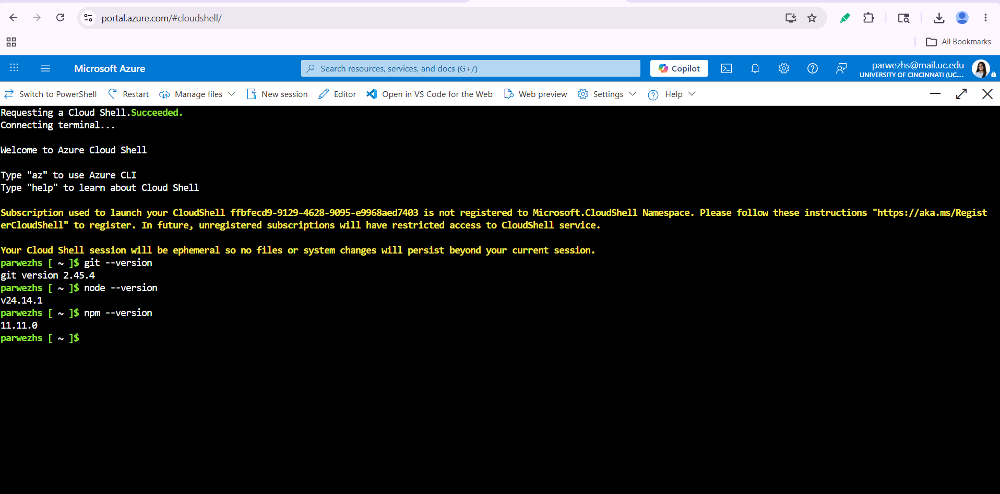
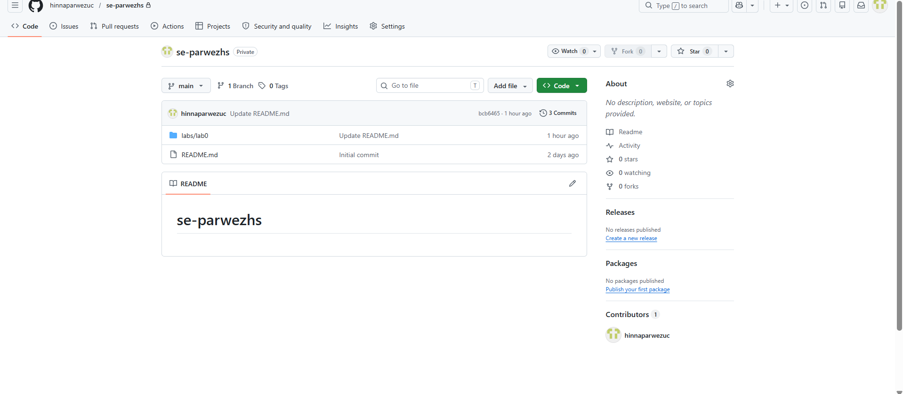
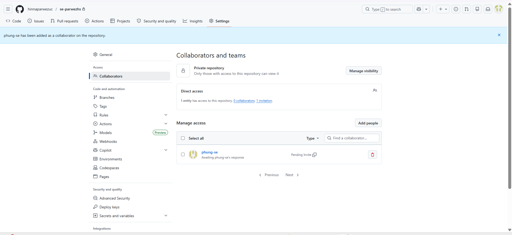
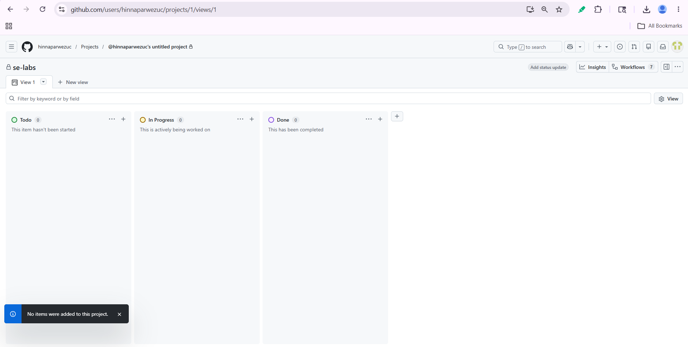
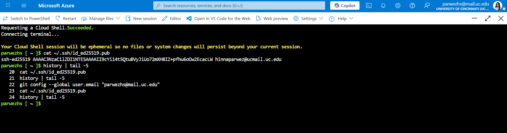

# EECE/CS 3093C – Software Engineering

## Instructor
Dr. Phu Phung

## Student
Hinna Parwez  
Email: parwezhs@mail.uc.edu

## Overview

This lab focused on setting up Azure Cloud Shell, GitHub repositories, SSH authentication, and git version control tools for the course environment.

Repository URL: [se-parwezhs](https://github.com/hinnaparwezuc/se-parwezhs)

---

# Part I – Azure for Students and Cloud Shell

## Azure Subscription

This screenshot shows my Azure for Students subscription and available student credits.

## Cloud Shell Version Check

This screenshot shows successful installation and version verification of git, node, and npm in Azure Cloud Shell.

---

# Part II – GitHub Repository Setup

## Private Repository

This screenshot shows my private GitHub repository.

## Collaborator Added

This screenshot shows the instructor grading account added as a collaborator.

## GitHub Project Board

This screenshot shows the GitHub project board creation.

---

# Part III – SSH and Git Setup

## SSH Key Generation

This screenshot shows SSH key generation and the displayed public key.
