# EECE/CS 3093C – Software Engineering

## Instructor

Dr. Phu Phung

## Student

Hinna Parwez

Email: [parwezhs@mail.uc.edu](mailto:parwezhs@mail.uc.edu)

## Overview

This lab focused on developing and deploying a real-time messenger application using Node.js, Express, Socket.io, GitHub Actions, and Microsoft Azure App Service. The application was implemented by completing the Send Message and Receive Message use cases from the provided software skeleton. Security enhancements were then applied by implementing DOMPurify output sanitization and a Content Security Policy (CSP) to defend against Cross-Site Scripting (XSS) attacks.

**Repository URL:** https://github.com/hinnaparwezc/se-parwezhs

**Azure App Service URL:** https://lab1-rg-faetgzcufva6fdgy.canadacentral-01.azurewebsites.net

---

# Task 1 – Git Branch, Node.js Application Setup and Testing

## Local Application Running

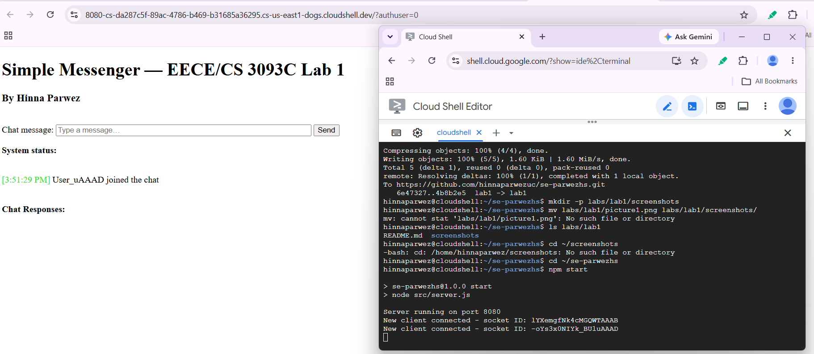

This screenshot shows the messenger application successfully running in Google Cloud Shell after installing the required dependencies and executing the application.

## GitHub Commit

Task 1 Commit URL: https://github.com/hinnaparwezuc/se-parwezhs/commit/9f665cc7f912e1d2f82c853719fe4640face887d

---

# Task 2 – Azure Deployment and GitHub Actions

## Azure App Service

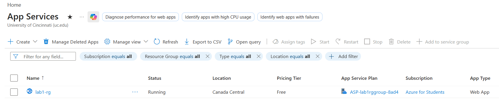

This screenshot shows the messenger application successfully deployed to Microsoft Azure App Service.

## GitHub Actions Workflow

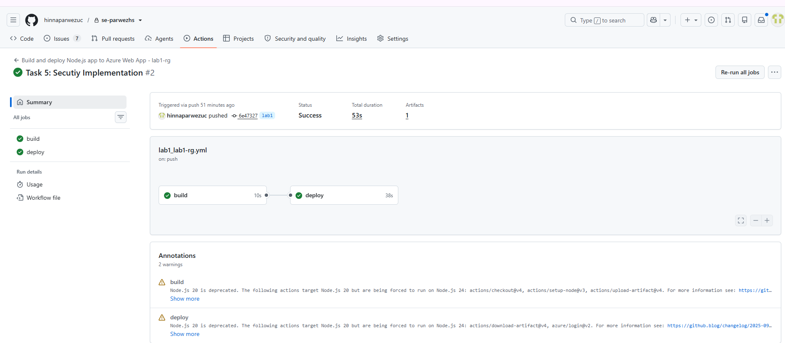

This screenshot shows the successful GitHub Actions workflow used to automatically deploy the application.

## Live Azure Application

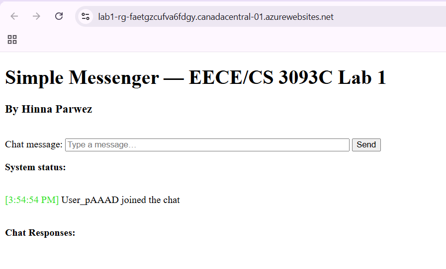

This screenshot shows the messenger application running successfully from the Azure deployment.

---

# Task 3 – Send Message Implementation

## Client Implementation

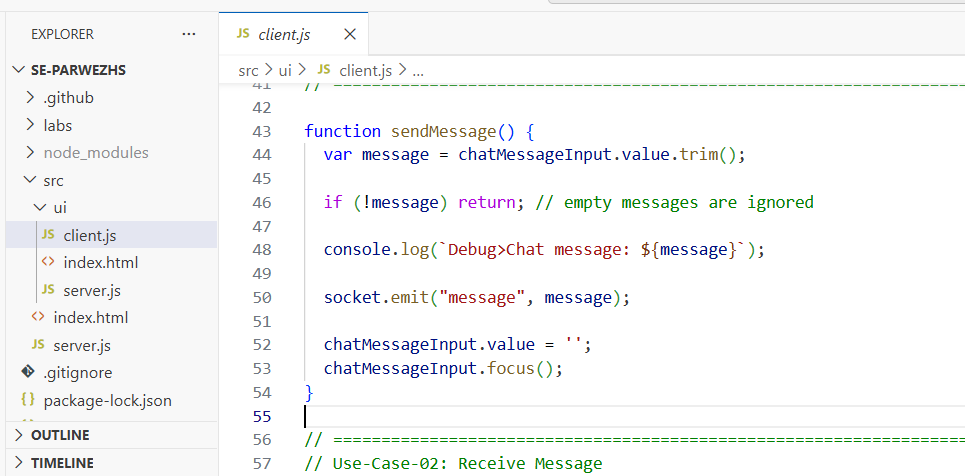

This screenshot shows the implementation of the `sendMessage()` function inside `client.js`.

## Server Implementation

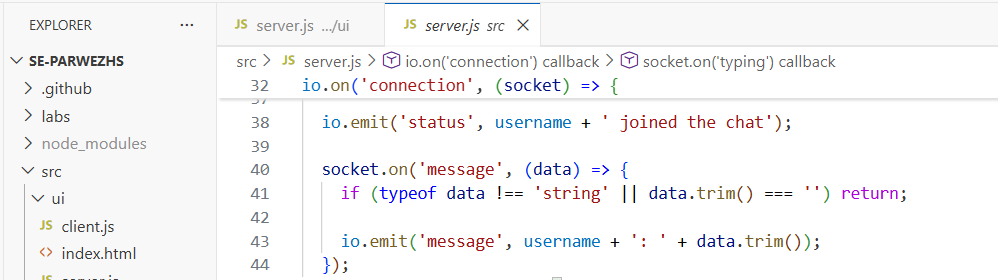

This screenshot shows the server-side Socket.io message broadcast implementation inside `server.js`.

## Application Demonstration

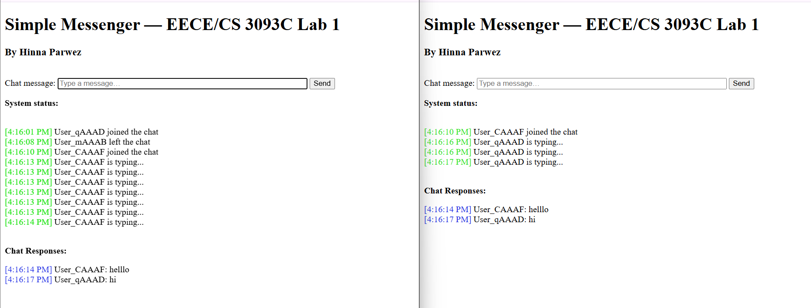

This screenshot demonstrates two connected browser windows successfully exchanging chat messages.

## GitHub Commit

Task 3 Commit URL: https://github.com/hinnaparwezuc/se-parwezhs/commit/6e47327754ae921fbc8e00d9e4eb251385828edb

---

# Task 4 – Receive Message Implementation

## Client Message Listener

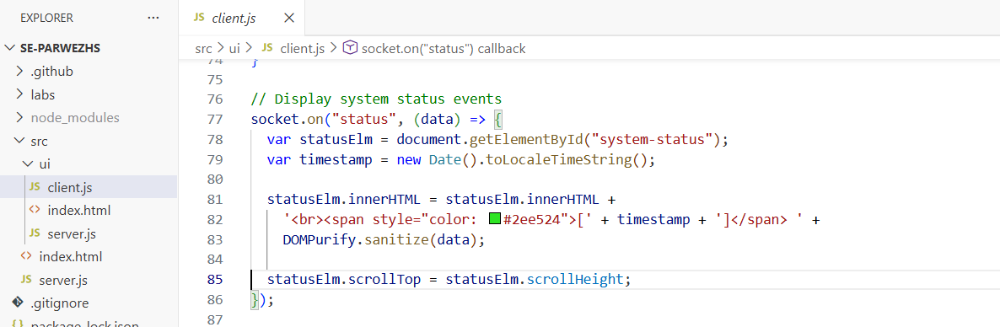

This screenshot shows the client-side implementation for receiving chat messages and displaying timestamps.

## Server Status Events

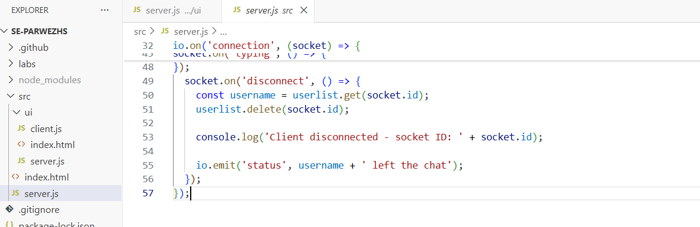

This screenshot shows the server implementation for user connection and disconnection status notifications.

## Application Demonstration

This screenshot demonstrates timestamped chat messages together with join and leave status notifications.

## GitHub Commit
Task 4 Commit URL: https://github.com/hinnaparwezuc/se-parwezhs/commit/6e47327754ae921fbc8e00d9e4eb251385828edb

---

# Task 5 – SSDLC and Security Implementation

## GitHub Issue Update

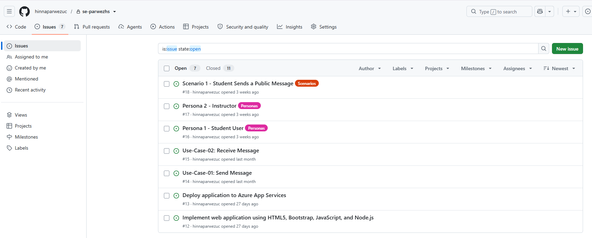

This screenshot shows the GitHub Issue updated with the additional security user stories and acceptance criteria before implementation.

## XSS Attack Before the Fix

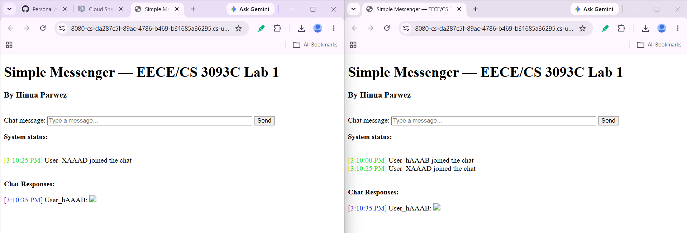

This screenshot demonstrates the successful Cross-Site Scripting (XSS) attack before implementing the security protections.

## XSS Attack After the Fix

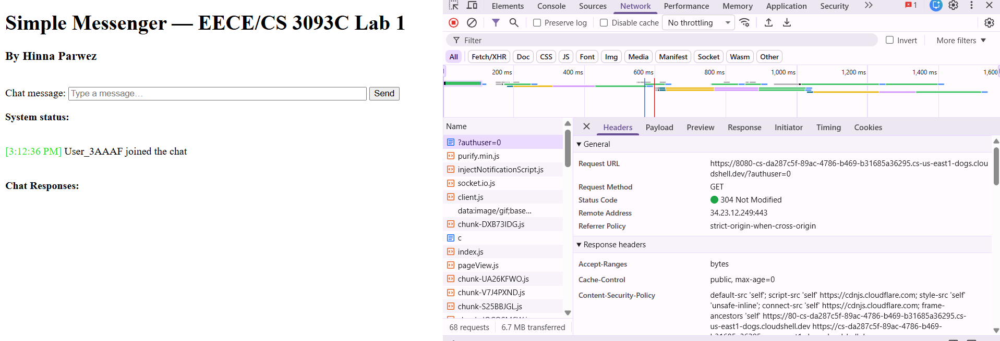

This screenshot demonstrates that the malicious payload is sanitized by DOMPurify and no JavaScript alert executes after the security implementation.

## Content Security Policy

This screenshot shows the browser DevTools Network tab displaying the configured `Content-Security-Policy` response header.

## GitHub Commit
Task 5 Commit URL: https://github.com/hinnaparwezuc/se-parwezhs/commit/6e47327754ae921fbc8e00d9e4eb251385828edb

Task 5 Commit URL:
